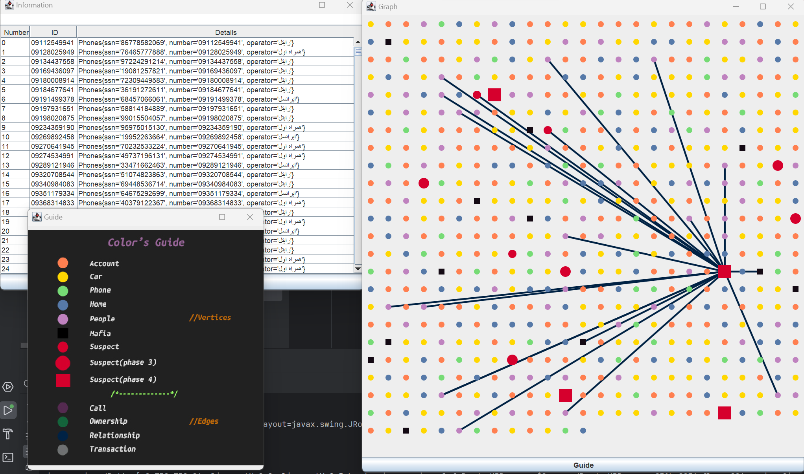

# Project Overview
Developed as the University of Isfahan Datastructures course's project, The project aims to uncover and analyze the intricate web of corruption within government institutions and their connections to criminal organizations, particularly in cases of fuel and drug smuggling. The project involves using data analysis and graph search techniques to identify suspects.

## Data Model
The project utilizes a graph-based data model consisting of vertices and edges to represent various entities and their relationships. Here are the key elements of the data model:

Vertices: Represent entities such as individuals, bank accounts, houses, cars, and mobile phone numbers. Each vertex has a unique key for identification and has special features.

Edges: Represent relationships between entities and include different attributes.

## Phases
The system performs its search in three phases and identifies the suspects in each phase. The suspects of the final phase were the people with the highest probability of cooperation in smuggling.
